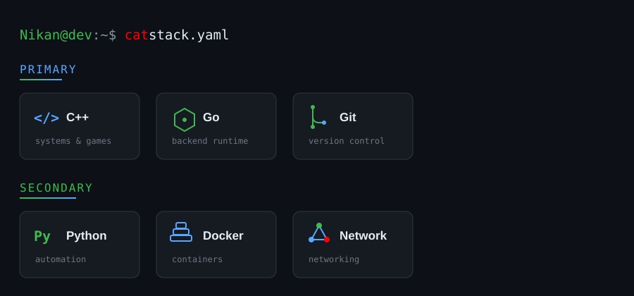

  

  

  

---

## Breaking systems down to understand how they really work

I'm Nikan Majidi, a backend developer working at the intersection of clean system design and cybersecurity.
My sweet spot is the space between building and breaking — writing solid backend systems, then stepping back to look at them the way an attacker would.

---

## What I'm focused on

- 🔧 Backend Development
- 🏗️ System Design & Clean Architecture
- 🌐 Networking & Security Fundamentals

---

## Tech Stack

---

## GitHub Stats

---

### Connect With Me

<a href="https://www.linkedin.com/in/nikanmajidi/">LinkedIn</a>
•
<a href="mailto:amirnikanmajidi@example.com">Email</a>
•
<a href="https://github.com/nikitaito">GitHub</a>

---

  

